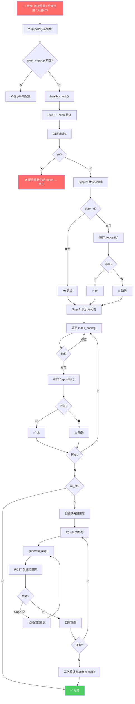
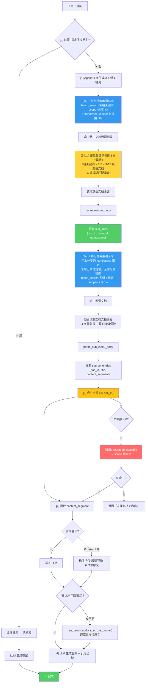

# 语雀 AI Skill

> 语雀全功能 AI Agent 技能 —— 知识库管理、文档 CRUD、小记管理、目录编排、批量导出、两级索引知识库问答（纯 LLM + 语雀 API，零外部依赖），一切通过自然语言驱动。

> 📄 **Skill 规范文档**：[SKILL.md](./SKILL.md) — AI Agent 执行指南，所有功能细节以该文件为准。

**核心理念：用语雀 API 替代手工操作，AI 替你调用。**

[](https://github.com/yehuoshun/yuque-ai-skill/releases)
[](./LICENSE)
[](./SKILL.md)

📖 **AI Agent 执行规范 → [SKILL.md](./SKILL.md)**

## 目录

- [功能特性](#功能特性)
- [前置条件](#前置条件)
- [快速开始](#快速开始)
- [配置说明](#配置说明)
- [使用方式](#使用方式)
- [知识库问答](#知识库问答)
- [项目结构](#项目结构)
- [API 参考](#api-参考)

## 功能特性

| 功能 | 说明 |
|------|------|
| 📚 **知识库管理** | 列表/创建/更新/删除知识库，slug 格式自动校验 |
| 📝 **文档管理** | CRUD 全支持，创建后自动挂载目录，硬删除需二次确认 |
| 📋 **小记管理** | 创建/列表/详情/更新/软删除/恢复，自动处理嵌套 content 结构 |
| 📂 **目录编排** | TOC API 增删改，sibling/child 双模式挂载 |
| 📤 **文档导出** | 单篇/批量导出 Markdown，TOC 还原目录树，图片本地化，增量导出 |
| 🔍 **文档搜索** | 按关键词搜索文档（索引模式 namespace 限定，降级模式全库搜索），结果高亮 |
| 🚦 **双轨并发** | API 轨动态浮动（上限 10），LLM 轨内存公式驱动，429 自动退避 |
| 🩺 **健康检查** | `health_check()` 批量验证 Token + 所有知识库，`generate_slug()` 自动生成 slug，`update_config()` 回写配置 |
| 🔗 **跨库引用** | 自动解析 namespace 与 book_id 互转 |
| 🛡️ **错误处理** | 401/403/404/429/5xx 分级处理，Token 失效自动提示更新 |
| 📊 **任务汇总** | 导出完成后通知（成功/失败/跳过/路径/耗时） |
| 🧠 **知识库问答** | 自然语言提问，两级索引（总库路由 → 子库关键词），多路并发搜索，LLM 生成答案 + 引用出处 |

## 前置条件

| 步骤 | 检查项 | 说明 |
|------|--------|------|
| 1 | **语雀 Token** | 需 `doc:read` `doc:write` `repo:read` `repo:write` 权限 |
| 2 | **配置文件** | skill 目录下 `config/yuque-config.json`，首次从 `config/yuque-config.example.json` 复制 |
| 3 | **Python 3.8+** | 纯标准库（`urllib.request`），无需 pip install |

## 快速开始

**方式一：下载 Zip（推荐）**

```bash
wget https://github.com/yehuoshun/yuque-ai-skill/releases/latest/download/yuque-ai-skill.zip
unzip yuque-ai-skill.zip
cd yuque-ai-skill
```

**方式二：Git Clone**

```bash
git clone https://github.com/yehuoshun/yuque-ai-skill.git
cd yuque-ai-skill
```

### 1. 配置

```bash
cp config/yuque-config.example.json config/yuque-config.json
# 编辑填入 token、group、default_book，详见下方「配置说明」
```

### 2. 使用

见下方「使用方式」，直接对 AI Agent 说即可。

## 配置说明

### 语雀 Token

在 [语雀开放平台](https://www.yuque.com/settings/tokens) 创建 Token，需勾选：

- `doc:read` — 读取文档
- `doc:write` — 创建/修改文档
- `repo:read` — 读取知识库
- `repo:write` — 修改知识库目录

### 完整配置

配置文件位于 skill 目录下 `config/yuque-config.json`。

```json
{
  "token": "语雀 API Token",
  "group": "yehuoshun",
  "default_book": { "book_id": 78276514, "namespace": "yehuoshun/index-sub-1" },
  "index_books": [
    { "book_id": 77321523, "namespace": "yehuoshun/wwqac0" }
  ]
}
```

| 配置项 | 说明 |
|--------|------|
| `token` | 语雀 API Token（必填） |
| `group` | 语雀用户名/login（必填） |
| `default_book` | 默认知识库，创建文档时未指定目标则使用此库 |
| `index_books` | 索引总库。`[0]` = 索引总库（路由层），子库从总库路由文档动态发现 |

### 初始化验证

配置完成后运行健康检查，一次性验证 Token + 所有知识库：

```bash
python3 yuque_api.py health-check
```

输出 `all_ok: true` 表示一切正常，否则按提示创建缺失的知识库。详见 [SKILL.md#初始化流程](./SKILL.md#初始化流程)。

#### 初始化流程图



### 速率限制

| 限制项 | 上限 |
|--------|------|
| API QPS | 100/s |
| 每小时请求 | 5000/h |
| 单知识库文档数 | 5000 |

## 使用方式

由 AI Agent 驱动。提到「语雀」「小记」「知识库」即自动触发。

### 典型命令

| 场景 | 示例 |
|------|------|
| 知识库管理 | 「列出我的知识库」「创建一个知识库叫 XXX」 |
| 文档操作 | 「在 XXX 知识库创建一篇文档」「更新《XXX》的内容」 |
| 小记 | 「写一条小记」「查看今天的小记」「恢复那条删除的小记」 |
| 搜索 | 「在语雀搜索 XXX」 |
| 问答 | 「Docker 容器之间怎么通信」「Python 怎么处理异常」 |
| 导出 | 「导出《XXX》知识库」「批量导出所有文档」 |

详情见 [SKILL.md](./SKILL.md)「调用约定」。Agent 自动处理 Token 校验、并发调度、速率退避、结果校验。

## 项目结构

```
yuque-ai-skill/
├── SKILL.md              # Skill 规范文档（AI Agent 执行指南）
├── README.md             # 本文件
├── yuque_api.py          # 核心 API 封装（纯标准库，1000行）
├── yuque_search.py       # 搜索管线（两级索引+降级+跨库读取，688行）
├── yuque_index.py        # 索引构建器（全量/增量，JSON格式，280行）
├── config/               # 配置文件目录
│   ├── yuque-config.example.json # 配置模板
│   └── yuque-config.json         # 实际配置（不入库）
├── references/
│   └── api_reference.md  # 语雀 OpenAPI 完整参考
└── .github/
    └── workflows/
        └── dingtalk-notify.yml  # CI：钉钉通知
```

## 知识库问答

两级索引（总库路由 → 子库关键词）+ 双路并行搜索 + LLM 生成答案。纯 LLM + 语雀 API，零外部依赖。

完整搜索管线、索引构建、搜索降级 → **[SKILL.md#一知识库问答系统](./SKILL.md#一知识库问答系统)**。

#### 搜索流程



**流程说明**（先总库定位 → 再子库搜索，顺序执行）：

| 步骤 | 说明 | 并行点 |
|------|------|--------|
| [0] 前置 | Agent LLM 判断是否指定文档名 → 是则短路 | — |
| [1] 总库路由 | 搜索引总库 title → 每组关键词各挑 3-5 → 读全文 → 拿到 namespace | ⚡ 多组关键词并发搜 |
| [2] 子库搜索 | 用 namespace 搜子库 title → 直接读全文（总库已精准定位）→ 提取 source_entries | ⚡ 多组关键词并发搜 |
| [3] 合并去重 | 按 doc_id 去重 | — |
| [4] 内容段提取 | 有 content_segment → 直接用；Lake → 标注「仅标题匹配」 | — |
| [5] 充足判断 | LLM 判断 → 不足则跨库并发读原文 | — |
| [6] 生成答案 | LLM 生成答案 + 引用出处 | — |

> 📄 完整细节 → [SKILL.md#一知识库问答系统](./SKILL.md#一知识库问答系统)

### Python 模块快速测试

```bash
# 健康检查
python3 yuque_api.py health-check

# API 测试
python3 yuque_api.py hello
python3 yuque_api.py list-repos
python3 yuque_api.py search "Java 面试" "yehuoshun/dil9w3"

# Slug 生成
python3 yuque_api.py generate-slug "测试知识库"

# 搜索管线
python3 yuque_search.py combined "Python" "列表"
python3 yuque_search.py degraded "Java 面试"

# 索引构建
python3 yuque_index.py list 70910909
python3 yuque_index.py read 70910909 240965425
python3 yuque_index.py changed 70910909 "2026-01-01T00:00:00+08:00"
```

## API 参考

详见 **[SKILL.md#二api-速查管理操作](./SKILL.md#二api-速查管理操作)**。完整端点/参数/错误码 → [references/api_reference.md](./references/api_reference.md)。

基地址：`https://www.yuque.com/api/v2`


